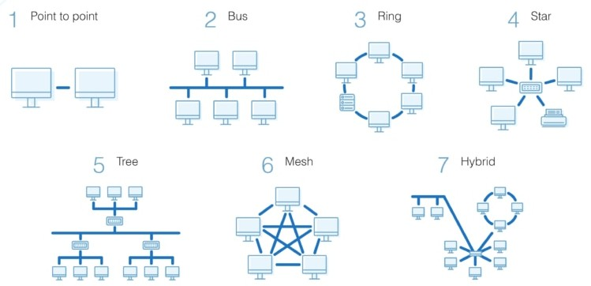
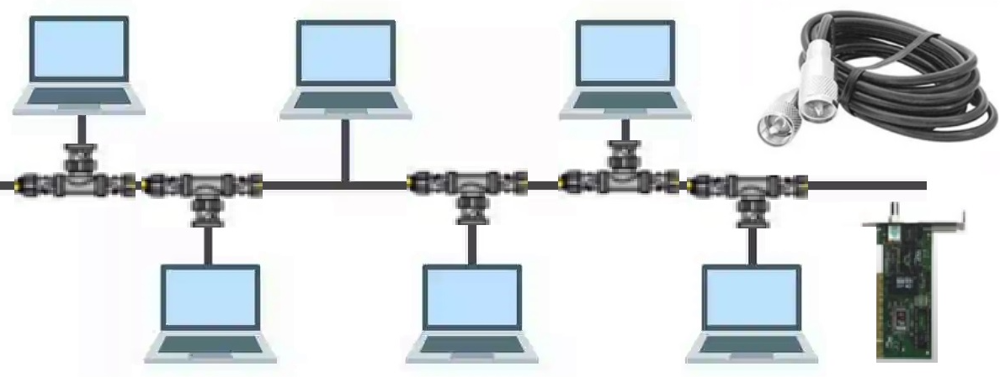
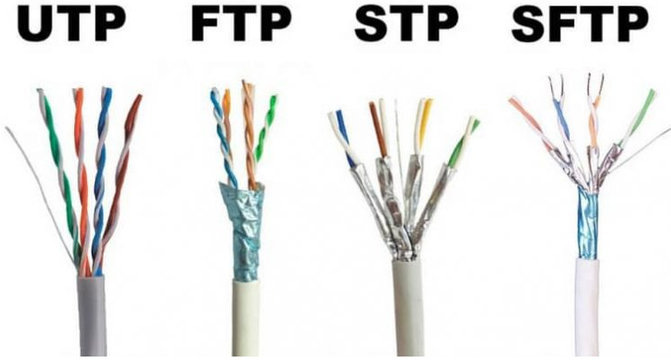
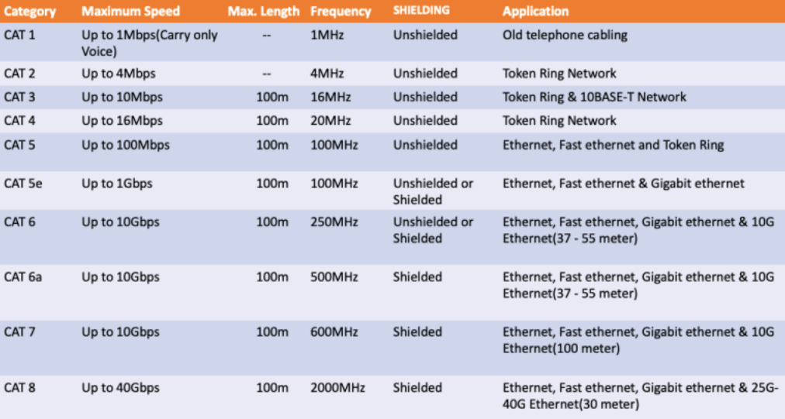

# Ağ Topolojileri 
  
*Görsel kaynağı: https://www.dnsstuff.com/what-is-network-topology

Ağ topolojileri "bir ağı oluşturan cihazların fiziksel ve mantıksal yerleşimidir". Network Topology (Ağ Topolojisi) Yerel Ağ Alanı (LAN) içerisinde bulunan bilgisayarların fiziksel ve mantıksal yerleşimini ifade eder. Fiziksel Topoloji ağ içerisinde bulunan tüm cihazların birbirlerine nasıl bağlanacağını ve bağlantı için ne tür kablo kullanacağını belirtirken Mantıksal Topoloji bu cihazların nasıl haberleşeceğini belirtir ve bu cihazları ortak bir protokol altında birleştirir. Kullanılmak istenen Ağ Teknolojisine göre farklı ağ topolojileri kullanılmaktadır. Fiziksel Topolojinin 6 farklı çeşidi vardır. Bunlar Bus(Yol), Ring(Halka), Yıldız(Star), Ext Star(Gelişmiş Yıldız), Mesh(Örgü) ve Tree(Ağaç) topolojileridir.
Broadcast(Yayın) ve Token Passing(İz) mantıksal topolojilere birer
örnektir.

## Doğrusal (Bus) Topoloji
Doğrusal bir hat üzerinde bilgisayarların T konnektörlerle bağlanması
şeklinde kurulur. Hattın her iki ucunda sonlandırıcı kullanmak
zorunludur. Koaksiyel kablo kullanılır. Ağın herhangi bir noktasında
arıza olması durumunda ağın tamamı çöker. Ağdaki veri trafiği tüm uçlara
gider. Herkes herkesin trafiğini görebilir. Bu yüzden çok fazla
**çakışma (collision)** olur.

  
*Görsel kaynağı: https://www.lunarcomputercollege.com/computer-network-topologies/*

## Halka (Ring) Topoloji
Doğrusal topolojiye benzer. Sonlandırıcı kullanılmaz. Hattın iki ucu
birleşiktir. Hatta sanal bir jeton dolaşır(token).Jeton sırası gelen
bilgisayar, jeton boş ise göndereceği veriyi hatta yerleştirir.
Bilgisayarlar sırayla veri gönderdiklerinden çakışma daha
azdır.Günümüzde hiç kullanılmamaktadır. Herkes herkesin verisini
kullanabilmektedir.

  
*Görsel kaynağı: https://www.cse.iitk.ac.in/users/dheeraj/cs425/lec07.html*

## Yıldız (Star) Topoloji
Merkezde dağıtıcı bir cihaz olur. Buradan tüm bilgisayarlara birer kablo
gider. Ağın bir noktasındaki arıza sadece ilgili bilgisayarın ağ
bağlantısına zarar verir. Genellikle **(**bükümlü çift (twisted
pair,xtp)) kullanılır. Trafiğin herkese mi gönderileceği ya da sadece
ilgili uca mı gideceği dağıtıcıya bağlıdır. Dağıtıcının performansı ve
kabiliyeti ağı doğrudan etkiler. Günümüzde en yaygın topolojidir.

  
*Görsel kaynağı: https://www.researchgate.net/publication/327897159_Hotel_Reservation_System_Based_Local_Area_Network_at_Samarinda*

## Örgü (Mesh) Topoloji

  
*Görsel kaynağı: https://www.nakivo.com/blog/types-of-network-topology-explained/*

Uçları arasında birden fazla rota üzerinde haberleşme imkanı olan
yapılardır. Günümüzde genellikle farklı yıldız ağlar arasında yedekleme
amacı olarak kullanılır. Bunun dışında kablosuz ağlarda da yaygın olarak kullanılmaktadır.
  
*Görsel kaynağı: https://www.researchgate.net/publication/234015211_FastM_Design_and_Evaluation_of_a_Fast_Mobility_Mechanism_for_Wireless_Mesh_Networks*

# Kablolar

## Bükümlü Çift Kablo (Twisted Pair Cable)
İçerisinde bükülmüş çiftler halinde bakır tel bulunur. Kabloların birbirleri üzerindeki direnç elektromanyetik etkisini azaltmak için ikişerli olarak sarılı durumundadırlar. 
  
*Bükümlü çift kablo*

  
*Görsel kaynağı: https://www.linx-com.com/copper-construction/*

- U: Unshilded (Korumasız)
- F: Foiled (Folyolu)
- S: Shielded (Korumalı)

## FREKANSLARINA GÖRE BÜKÜMLÜ ÇİFT KABLO
  
*Görsel kaynağı: https://dc.mynetworkinsights.com/categories-of-copper-twisted-pair-cables/*

{width="800"}
*Görsel kaynağı: https://telecom.samm.com/history-of-ethernet-lan-cables-categories*

!!! warning "CAT-1, CAT-2, CAT-3"
    Telefon hatlarında kullanılır, ağlarda kullanılmaz.  

<figure markdown="span">
  { width="800" }
  <figcaption>Görsel kaynağı: https://www.electricalvolt.com/how-to-crimp-rj45-connector/</figcaption>
</figure>

Bükümlü çift CAT5 VE CAT6 Kabloları sonlandırmak için RJ-45 adı verilen
konnektörler kullanılır. Bu kablolar iki farklı iki şekilde
sonlandırılabilir.**568-A,568-B**  
Kablonun iki ucunun aynı standartlarla sonlandırılmasına **düz (Straight
kablo)** denir. İki ucunda iki farklı standartta sonlandırılma yapılırsa
**çapraz(cross-over)kablo** adı verilir.

## ÇAPRAZ VE DÜZ KABLO

Düz kablo, bir bilgisayarı yönlendirici gibi bir ağ hub’ına bağlamak
için yerel alan ağlarında kullanılan bir tür bükümlü çift kablodur. Bu
tür kablolara bazen yama kablosu da denir ve bir veya daha fazla
bilgisayarın kablosuz bir sinyal yoluyla bir yönlendiriciye eriştiği
kablosuz bağlantılara bir alternatiftir. Aynı türden iki cihazı bağlamak
için genellikle bir çapraz kablo kullanılır. Düz kablo ve çapraz kablo
tasarımları aynı standartların ve kuralların çoğunu kullanır.

<figure>

<figcaption aria-hidden="true">kablolar</figcaption>
</figure>

Yeni ağ cihazlarının tamamı MDI/MDIX adı verilen teknoloji sayesinde
karşıdaki cihazın ne tarz bir cihaz olduğunu anlar ve hangi iletkenin ne
amaçla kullanılacağını buna göre düzenler. Diğerleri enerji göndermek
için kullanılır.

<figure>

<figcaption aria-hidden="true">kablolar-örnek</figcaption>
</figure>