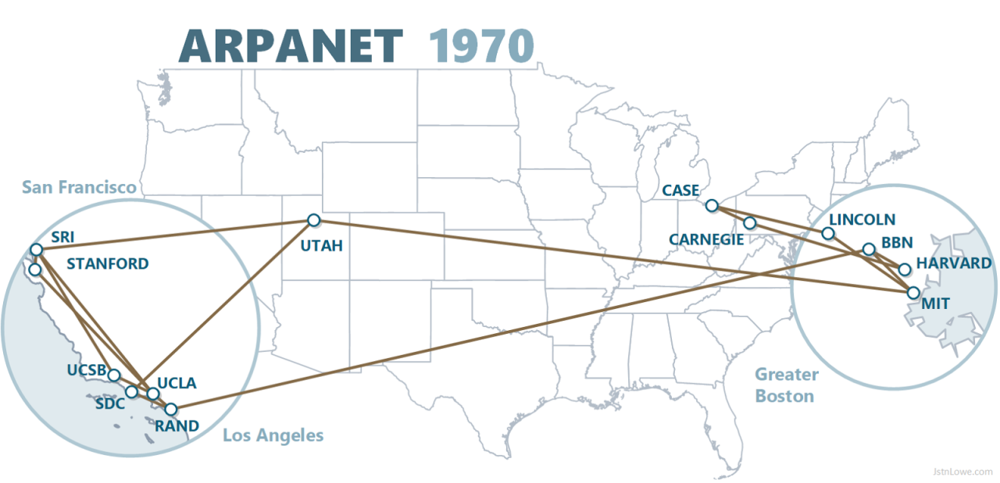
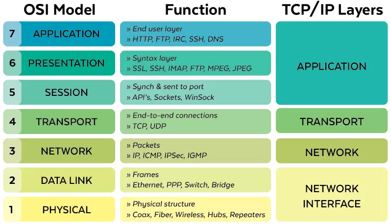
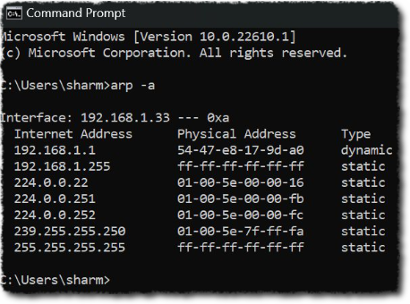
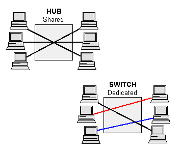

*[bps]: bit per second (saniyedeki bit sayısı)
*[RF]: Yüksek frekanslı dalgaya radyo frekans denilir. Bu dalga RF kısaltmasıyla gösterilir
[^1]: [OSI -Open Systems Interconnection- modeli ISO tarafından geliştirilmiştir.](https://tr.wikipedia.org/wiki/OSI_modeli)

# İnternet'in Kısa Tarihçesi
  
*ARPANET 1970*

ARPANET, "Advanced Research Projects Agency Network" (Gelişmiş Araştırma Projeleri Ajansı Ağı) kısaltmasıdır. ARPANET, ABD Savunma Bakanlığı'nın (DARPA) finanse ettiği ve 1960'ların sonlarında ve 1970'lerin başlarında geliştirildi. İnternet'in dedesidir.

TCP/IP modeli 1989'da 1122 ve 1123 numaralı RFC'ler ile yayınlanmıştır. OSI modeli ise 1978'de taslak olarak yayınlanmış, 1984'te ise standart halini almıştır.

1980'lerin sonlarında bu teknolojiler, sivil ve ticari kullanıma açılarak İnternet'i başlattı.

# OSI ve TCP/IP modelleri
Bilgisayar ağlarının nasıl çalıştığını anlamak için kullanılır. Geliştirilen donanımlar ve yazılımlar bu modellere uygun olursa İnternet üzerinde sorunsuzca iletişim kurabilirler.

  
*Görsel kaynağı: https://community.fs.com/article/tcpip-vs-osi-whats-the-difference-between-the-two-models.html*

  
*Görsel kaynağı: https://instrumentationtools.com/difference-tcpip-model-osi-model/*

# 03. OSI MODELİ KATMANLARI
Bir bilgisayardan gönderilen bir bilginin diğer bilgisayara nasıl ulaştığını anlatmak için tasarlanmıştır. İletişimi 7 katmanlı mimarı ile tanımlar. Ağ elemanlarının nasıl çalıştığını ve verinin iletimi sırasında hangi işlemlerden geçtiğini kavramak için kullanılan rehberdir. OSI[^1] Katmanlarının mantığını anlamak ağları planlamak, ağ üzerinden çalışan program yazmak ve ağ sorunlarını çözmek için önemlidir.

1.  [Fiziksel (Physical)](#fiziksel-katman)
2.  [Veri Bağı (Data link)](#veri-bag-katman)
3.  [Ağ (IP)](#subsubsec:ag_katmani)
4.  [Taşıma (Transport)](#subsubsec:tasima_katmani)
5.  Oturum (Session)
6.  Sunum (Presentation)
7.  [Uygulama (Application)](#subsubsec:tasima_katmani)

*Görsel kaynağı: https://planetechusa.com/layer-2-vs-layer-3-switches/*

  
*Görsel kaynağı: https://community.fs.com/article/tcpip-vs-osi-whats-the-difference-between-the-two-models.html*

## 1: Fiziksel Katman
Haberleşme kanalının elektriksel ve mekanik olarak tanımlandığı
katmandır. Bir uçtan gönderilen sinyalin karşı uca iletilmesinden
sorumludur. Sayısal haberleşmede en küçük birim bit olduğundan bu
katmanın hızı **bps, b/s (bit/saniye)** cinsindendir. Birinci katman
donanımları:

1. Bakır ve fiber optik kablolar
2. RF (Antenler)
3. Sinyali (işareti) elektrik olarak yükselten ve çoklayan HUB cihazları
4. Tekrarlayıcılar (repeater)
4. Kablosuz iletişimde kullanılan hava

## 2: Veri Bağı Katmanı
Verinin fiziksel ortamdan güvenli bir şekilde taşınmasından sorumlu olan
katmandır. Kaynaktan çıkan verilerin(bitler) hedefe ulaşan verilerle
aynı olup olmadığını sınayan sistemler kullanılır. En çok kullanılan
hata bulma algoritmaları **eşlik biti (parity check)** ve **CRC
algoritmasıdır**. Verinin doğru olup olmadığına bakmaz, sadece
sağlamlığını kontrol eder. Bu katmanda üst katmandan gelen veriler
çerçeve (frame) adı verilen paketleme işlemini tabi tutulur. Kapsülleme
de denir. Birbirine doğrudan bağlı ağ cihazlarının aynı kapsülleme
yöntemini (ikinci katman protokolünü) kullanması gerekir.

  
*Görsel kaynağı: https://www.computernetworkingnotes.com/ccna-study-guide/data-encapsulation-and-de-encapsulation-explained.html*

  
*Görsel kaynağı: https://en.wikipedia.org/wiki/Ethernet_frame*

  
*Görsel kaynağı: http://som.csudh.edu/cis/471/hout/netech/encapsulation.htm*

### Günümüzde en yaygın ikinci katman protokolleri
- **Yerel ağda (LAN)** : Ethernet  
- **Uzak ağlarda (WAN)** : Metroethernet. Eskiden ATM, PPP, Frame-Relay gibi protokoller vardı ama günümüzde kullanımı azaldı. Eskiden çevirmeli ağlarda kullanılan PPP yerine günümüzde PPPoE kullanılıyor artık.

  
*Görsel kaynağı: https://www.alfanett.com.tr/modem.html*

!!! info "LAN ve WAN nedir?"

    **LAN**: Local Area Network (yerel alan ağı). Kendi arazisi (binası) içerisinde, kimseden izin almaya gerek kalmadan kablolama yapılan ağlara LAN denir. Örneğin üniversite kampüsü ya da aynı binanın birkaç katını kullanan şirketler gibi.
    **WAN**: Wide Area Network (geniş alan ağı). Kurumların kendi arazisinin (binasının) dışında olan bir yer ile kurulan ağlardır. Sokağın karşısındaki binaya kablo çekemeyiz. Eğer karşılıklı iki binada iletişim kurulması gerekiyorsa, ISP (Internet Service Provider ~ internet servis sağlayıcı) firmadan hizmet satın almak gerekir.
    **LAN/WAN**: LAN'da istediğimiz kablolama türü ve istediğimiz protokolü kullanabiliriz. Hiç bir kısıtlama olmadan ağa bağlanabiliriz. WAN'da ise servis sağlayıcının sunduğu hizmetlerden ve onun kurallarına uyarak bağlanabiliriz.

### Anahtarlama Türleri
- **Devre Anahtarlama**: Veri aktarımı, fiziksel değişiklikle yapılır.
- **Paket Anahtarlama**: Veri aktarımı, her bir veri paketi için
    hesaplanarak, yazılımsal olarak yapılır.
  
*Görsel kaynağı: https://www.scaler.com/topics/computer-network/circuit-switching-and-packet-switching/*

### Ethernet Protokolünde Anahtarlama
Ethernet protokolünde kaynak ve hedef adresleri olarak **MAC** adresi
(fiziksel adres) kullanılır. Çakışmaları engellemek için aynı ağda iki
MAC adresi olmamalıdır.

  
*Windows'ta MAC adresi (fiziksel adres)*

### MAC Adres Tablosu
  
*Görsel kaynağı: https://community.spiceworks.com/t/how-to-find-ip-mac-addresses-on-cisco-ios-devices/1012165*

  
*Görsel kaynağı: https://www.geeksforgeeks.org/what-is-mac-address-table/*

Anahtarlar (switch) ikinci katmanda çalışır. Anahtarlar portlarına bağlı
olan cihazların MAC adreslerini bilmek zorundadır (otomatik öğrenir). Bu
şekilde iki farklı portu arasındaki trafiği, diğer cihazlar görmeden
aktarabilirler. **HUB’lardan en önemli farkı budur**.

  
*Görsel kaynağı: https://www.pcmag.com/encyclopedia/term/ethernet-hub*

## 3: Ağ Katmanı (IP)

İnternet dünyanın farklı yerlerindeki ağlar üzerinden erişebilir kiler
katman budur. Kaynak ve hedef olarak IP adresi kullanılır. IP
yönlendirilebilir bir protokol olduğundan her türlü veri aağı üzerinden
haberleşmeye olarak sağlanır. Bu katman en önemli görevi yönlendirme
işlemidir. Yönlendirme işlemi birden fazla ağ arayüzüne (network
interface) sahip olan yönlendirici(router) adı verilen cihazlar
tarafından yapılır. IP internetin temel protokolüdür. Yani bir PC
internete bağlanacaksa IP’yi mutlaka biliyor olmalıdır. Bazı anahtarlar
üçüncü katmanda da çalışabilmektedir.

<figure>

<figcaption aria-hidden="true">AĞ Katmanı</figcaption>
</figure>

1.  **A,B,C** aynı ağdadır. Birbirleriyle MAC adresleriyle haberleşir
    (2. katman).

2.  **X,Y,Z** aynı ağdadır. Birbirleriyle MAC adresleriyle haberleşir
    (2. katman).

1.  **En küçük birimine paketleme denir.**

## 4: Taşıma Katmanı

İnternette IP üzerinde kullanılan 2 tane 4. katman protokolü vardır.
Bunlar **TCP** ve **UDP** dir. Bu katman uygulama programları
için seri iletişim kanalları kuran katmandır. Bu kanallar port adı
verilen servis numaralarıyla kurulur.

**TCP**[^2]: Bağlantı temelli bir protokoldür. Trafik başlamadan önce
karşıdaki uca müsait olup olmadığı sorulur. Bu yönüyle telefon
görüşmesine benzer.

**UDP**[^3]: Bağlantı temelli değildir. Trafik doğrudan başlatıldığı
için paketlerin iletimi garanti edilmez. SMS gönderimine benzetilebilir.
Özellikle gerçek zamanlı görüntü ve ses taşıma uygulamalarında
elverişlidir. **TCP**’ye göre daha **hızlıdır**.

**Örnek**: 3 way handshaking - 3 aşamalı el sıkışma

<figure>

<figcaption aria-hidden="true">TCP Protokolü</figcaption>
</figure>

Oturum açıldıktan sonra ilk olacak - Veri kaç parçada gönderilecek  
1GB filmi  
80 segmentte ⇒ (1180 2180 .... 80/80) bunlar paketlenir.

**TCP**’de sadece yavaşlama olacak görürüz. En önemli avantajı budur.

<figure>

<figcaption aria-hidden="true">UDP Protokolü</figcaption>
</figure>

**UDP**’nin avantajı hızlı **TCP**’ye göre. Dezavantajı ise güvensiz.

**Örneğin**: İnternetten radyo dinleyeceğiz bunu **UDP** ile dinlemek
zorundayız, çünkü GB belli değil. **TCP**’de önemlidir.

Dördüncü katmanın bir başka görevi de üst katmanlardan gelen veriyi
bölümleyerek daha küçük parçalara ayırmaktır. Bu parçalara **segment**
denir.

|            TCP             |    UDP     |     |
|:--------------------------:|:----------:|:---:|
| Güvenli ( oturum temelli ) | Oturum yok |     |
|           Yavaş            |   Hızlı    |     |

TCP vs UDP

## 5-7: Uygulama Seviyesi Katmanları

Aslında uygulama seviyesi sadece 7. katmandır. Ancak 5 ve 6 yaygın
kullanılmadığından ve farklı uygulamalar arasında standart olmadığından
bu derste üçüncu tek başlkta inceliyoruz.

Uygulama programları genellikle 7. katmanda ulaşmakta ve genellikle
doğruden 4. katman ile iletişime geçmektedir.

**TELNET**: Ağlarda yönetim ve kontrol
amaclı kullanılır. Ağ cihazlarının genellikle tamamı **telnet** ile
yönetimi destekler. 2 cihaz arasında 4. katmanda bağlantı
(erişebilirlik) kontrolü yapmak için **telnet** kullanılır.

\*\* **Port tarama uygulamaları**  
4. katmanda açık olan **TCP/UDP**
portlarını tarar.

**nmap**: **TCP** yada **UDP**’ye kadar
**0-65536**’ye kadar port taraması yapar.

| **OBS**               | **Uzak masaüstu**       | **nmap -\> OS dedikten** |
|:----------------------|:------------------------|:-------------------------|
| Port tarama           | TCP 3389                | obs.bilecik.edu.tr       |
| 79.123.244.212 -\> IP | 79.123.244.212 start IP | cevaplar                 |
| TCP 80 open           | 79.123.244.212 end IP   | tahmin                   |

Örnek

