# OSI Modeli

## İnternet'in Kısa Tarihçesi

  
*ARPANET 1970*

ARPANET, "Advanced Research Projects Agency Network" (Gelişmiş Araştırma Projeleri Ajansı Ağı) kısaltmasıdır. ARPANET, ABD Savunma Bakanlığı'nın (DARPA) finanse ettiği ve 1960'ların sonlarında ve 1970'lerin başlarında geliştirildi. İnternet'in dedesidir.

TCP/IP modeli 1989'da 1122 ve 1123 numaralı RFC'ler ile yayınlanmıştır. OSI modeli ise 1978'de taslak olarak yayınlanmış, 1984'te ise standart halini almıştır.

1980'lerin sonlarında bu teknolojiler, sivil ve ticari kullanıma açılarak İnternet'i başlattı.

## OSI ve TCP/IP modelleri

Bilgisayar ağlarının nasıl çalıştığını anlamak için kullanılır. Geliştirilen donanımlar ve yazılımlar bu modellere uygun olursa İnternet üzerinde sorunsuzca iletişim kurabilirler.

  
*Görsel kaynağı: <https://community.fs.com/article/tcpip-vs-osi-whats-the-difference-between-the-two-models.html>*

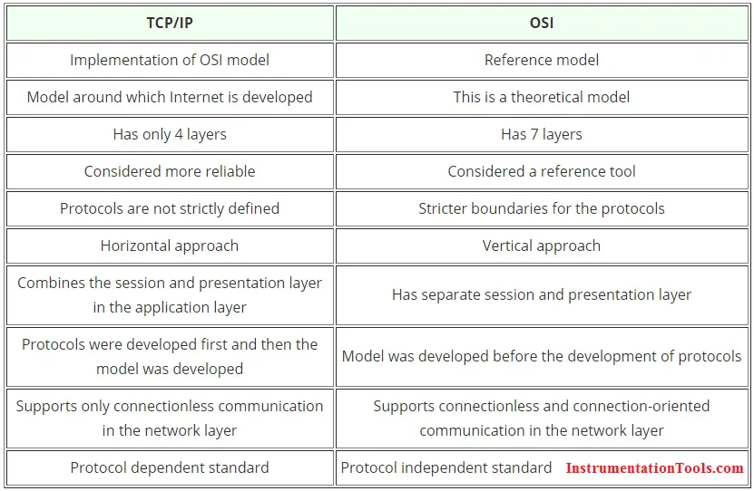  
*Görsel kaynağı: <https://instrumentationtools.com/difference-tcpip-model-osi-model/>*

## OSI MODELİ KATMANLARI

Bir bilgisayardan gönderilen bir bilginin diğer bilgisayara nasıl ulaştığını anlatmak için tasarlanmıştır. İletişimi 7 katmanlı mimarı ile tanımlar. Ağ elemanlarının nasıl çalıştığını ve verinin iletimi sırasında hangi işlemlerden geçtiğini kavramak için kullanılan rehberdir. OSI Katmanlarının mantığını anlamak ağları planlamak, ağ üzerinden çalışan program yazmak ve ağ sorunlarını çözmek için önemlidir.

- 7-Uygulama (Application)
- 6-Sunum (Presentation)
- 5-Oturum (Session)
- 4-Taşıma (Transport)
- 3-Ağ (IP)
- 2-Veri Bağlantı (Data link)
- 1-Fiziksel (Physical)

  
*Görsel kaynağı: <https://www.practicalnetworking.net/series/packet-traveling/osi-model/>*

  
*Görsel kaynağı: <https://planetechusa.com/layer-2-vs-layer-3-switches/>*

  
*Görsel kaynağı: <https://community.fs.com/article/tcpip-vs-osi-whats-the-difference-between-the-two-models.html>*

### 1: Fiziksel Katman

Haberleşme kanalının elektriksel ve mekanik olarak tanımlandığı
katmandır. Bir uçtan gönderilen sinyalin karşı uca iletilmesinden
sorumludur. Sayısal haberleşmede en küçük birim bit olduğundan bu
katmanın hızı **bps, b/s (bit/saniye)** cinsindendir. Birinci katman
donanımları:

1. Bakır ve fiber optik kablolar
1. RF (Antenler)
1. Sinyali (işareti) elektrik olarak yükselten ve çoklayan HUB cihazları
1. Tekrarlayıcılar (repeater)
1. Kablosuz iletişimde kullanılan hava

### 2: Veri Bağlantı Katmanı

Verinin fiziksel ortamdan güvenli bir şekilde taşınmasından sorumlu olan
katmandır. Kaynaktan çıkan verilerin(bitler) hedefe ulaşan verilerle
aynı olup olmadığını sınayan sistemler kullanılır. En çok kullanılan
hata bulma algoritmaları **eşlik biti (parity check)** ve **CRC
algoritmasıdır**.

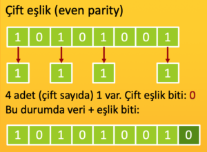  
*Görsel kaynağı: <https://www.hbmacit.com/2020/06/12/c-ile-parite-biti-hesaplama/>*

Verinin doğru olup olmadığına bakmaz, sadece
sağlamlığını kontrol eder. Bu katmanda üst katmandan gelen veriler
çerçeve (frame) adı verilen paketleme işlemini tabi tutulur. Kapsülleme
de denir. Birbirine doğrudan bağlı ağ cihazlarının aynı kapsülleme
yöntemini (ikinci katman protokolünü) kullanması gerekir.

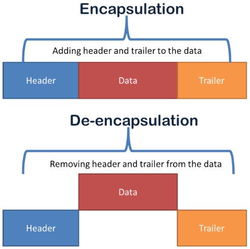  
*Görsel kaynağı: <https://www.computernetworkingnotes.com/ccna-study-guide/data-encapsulation-and-de-encapsulation-explained.html>*

  
*Görsel kaynağı: <https://en.wikipedia.org/wiki/Ethernet_frame>*

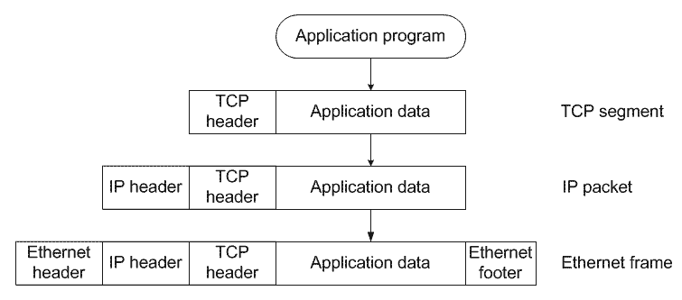  
*Görsel kaynağı: <http://som.csudh.edu/cis/471/hout/netech/encapsulation.htm>*

!!! note "Günümüzde en yaygın ikinci katman protokolleri"
    - Yerel ağda (LAN): **Ethernet**  
    - Uzak ağlarda (WAN) : **Metroethernet**. Eskiden ATM, PPP, Frame-Relay gibi protokoller vardı ama günümüzde kullanımı azaldı. Eskiden çevirmeli ağlarda kullanılan PPP yerine günümüzde PPPoE kullanılıyor artık.

  
*Görsel kaynağı: <https://www.alfanett.com.tr/modem.html>*

### LAN ve WAN nedir?

- **LAN**: Local Area Network (yerel alan ağı). Kendi arazisi (binası) içerisinde, kimseden izin almaya gerek kalmadan kablolama yapılan ağlara LAN denir. Örneğin üniversite kampüsü ya da aynı binanın birkaç katını kullanan şirketler gibi.
- **WAN**: Wide Area Network (geniş alan ağı). Kurumların kendi arazisinin (binasının) dışında olan bir yer ile kurulan ağlardır. Sokağın karşısındaki binaya kablo çekemeyiz. Eğer karşılıklı iki binada iletişim kurulması gerekiyorsa, ISP (Internet Service Provider ~ internet servis sağlayıcı) firmadan hizmet satın almak gerekir.
- **Fark ne?**: LAN'da istediğimiz kablolama türü ve istediğimiz protokolü kullanabiliriz. Hiç bir kısıtlama olmadan ağa bağlanabiliriz. WAN'da ise servis sağlayıcının sunduğu hizmetlerden ve onun kurallarına uyarak bağlanabiliriz.

### Anahtarlama Türleri

- **Devre Anahtarlama**: Veri aktarımı, fiziksel değişiklikle yapılır.
- **Paket Anahtarlama**: Veri aktarımı, her bir veri paketi için
    hesaplanarak, yazılımsal olarak yapılır.

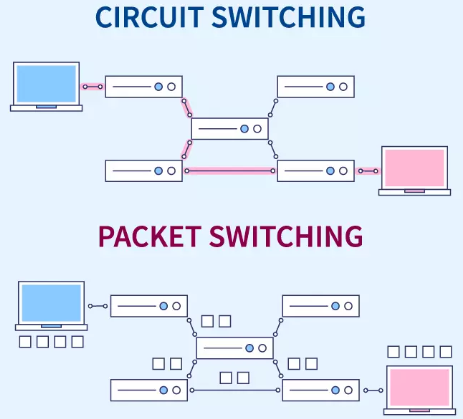  
*Görsel kaynağı: <https://www.scaler.com/topics/computer-network/circuit-switching-and-packet-switching/>*

### Ethernet Protokolünde Anahtarlama

Ethernet protokolünde kaynak ve hedef adresleri olarak **MAC** adresi
(fiziksel adres) kullanılır. Çakışmaları engellemek için aynı ağda iki
MAC adresi olmamalıdır.

  
*Windows'ta MAC adresi (fiziksel adres)*

### MAC Adres Tablosu

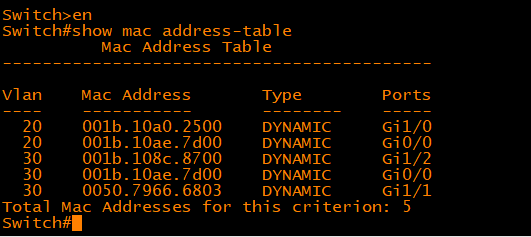  
*Görsel kaynağı: <https://community.spiceworks.com/t/how-to-find-ip-mac-addresses-on-cisco-ios-devices/1012165>*

  
*Görsel kaynağı: <https://www.geeksforgeeks.org/what-is-mac-address-table/>*

Anahtarlar (switch) ikinci katmanda çalışır. Anahtarlar portlarına bağlı
olan cihazların MAC adreslerini bilmek zorundadır (otomatik öğrenir). Bu
şekilde iki farklı portu arasındaki trafiği, diğer cihazlar görmeden
aktarabilirler. **HUB’lardan en önemli farkı budur**.

  
*Görsel kaynağı: <https://www.pcmag.com/encyclopedia/term/ethernet-hub>*

### 3: Ağ Katmanı (IP)

İnternet'i dünyanın farklı yerlerindeki ağlar üzerinden erişilebilir kılan
katman budur. Kaynak ve hedef olarak IP adresi kullanılır. IP
yönlendirilebilir bir protokol olduğundan her türlü veri ağı üzerinden
haberleşmeye olarak sağlanır. Bu katman en önemli görevi yönlendirme
işlemidir. Yönlendirme işlemi birden fazla ağ arayüzüne (network
interface) sahip olan yönlendirici(router) adı verilen cihazlar
tarafından yapılır. IP internetin temel protokolüdür. Yani bir PC
internete bağlanacaksa IP’yi mutlaka biliyor olmalıdır.
!!! note
    3\. katmanda aktarılan verinin en küçük anlamlı birimine `paket` denir.

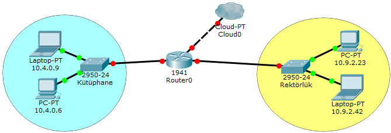  
*Ağlar arası bağlantı*

Farklı ağların birbiri ile görüşmesi için mutlaka yönlendirme yapılması gerekir. Yukarıdaki şekilde iki farklı ağ yönlendirme yapılarak bağlanmıştır.

- **Kütüphane** tarafındaki bilgisayarlar aynı ağdadır. Birbirleriyle MAC adresleriyle haberleşir (2. katman).
- **Rektörlük** tarafındaki bilgisayarlar aynı ağdadır. Birbirleriyle MAC adresleriyle haberleşir (2. katman).
- **Kütüphane** ve **Rektörlük** bilgisayarları farklı ağlarda olduklarından birbirleriyle MAC adresleriyle haberleşemez, IP adresi ile yönlendirme yapılarak haberleşebilirler. (3. katman).

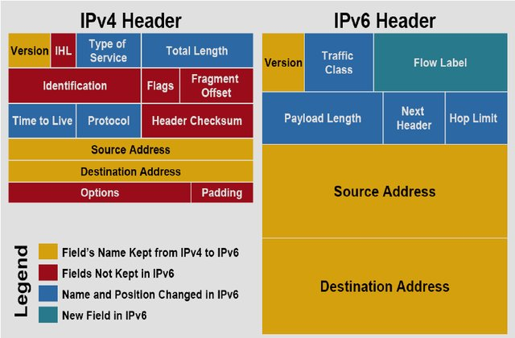  
*Görsel Kaynağı: <https://www.researchgate.net/publication/269810379_IPv4IPv6_Transition>*

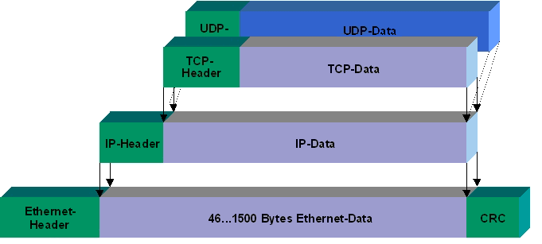  
*Görsel Kaynağı: <https://infosys.beckhoff.com/english.php?content=../content/1033/bc9191/2792604555.html&id=>*

### 4: Taşıma Katmanı

İnternette IP üzerinde kullanılan 2 tane 4. katman protokolü vardır.
Bunlar `TCP` ve `UDP`'dir. Bu katman uygulama programları
için seri iletişim kanalları kuran katmandır. Bu kanallar port adı
verilen servis numaralarıyla kurulur.

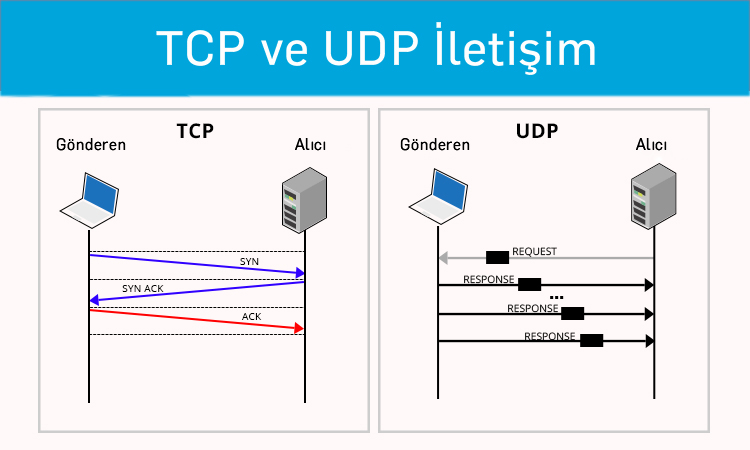  
*Görsel Kaynağı: <https://www.karel.com.tr/bilgi/tcp-ve-udp-arasindaki-farklar-nedir>*

- **TCP**: Bağlantı temelli bir protokoldür. Trafik başlamadan önce
karşıdaki uca müsait olup olmadığı sorulur. Bu yönüyle telefon
görüşmesine benzer.
- **UDP**: Bağlantı temelli değildir. Trafik doğrudan başlatıldığı
için paketlerin iletimi garanti edilmez. SMS gönderimine benzetilebilir.
Özellikle gerçek zamanlı görüntü ve ses taşıma uygulamalarında
elverişlidir. TCP’ye göre daha hızlıdır.

  
*Görsel Kaynağı: <https://medium.com/@mehmet.topac/tcp-nedi%CC%87r-udp-nedi%CC%87r-farklari-nelerdi%CC%87r-6ff6a29573b7>*

#### 3 way handshaking - 3 aşamalı el sıkışma

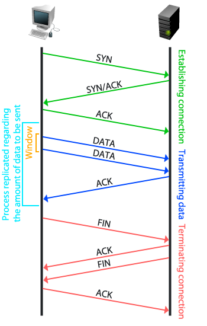  
*Görsel Kaynağı: <https://toschprod.wordpress.com/2012/01/30/osi-model-layer-4-transport/>*

{width="400"}  
*Görsel Kaynağı: <https://www.reddit.com/r/ProgrammerHumor/comments/18hkwj0/acknowledge/>*

!!! note
    Dördüncü katmanın bir başka görevi de üst katmanlardan gelen veriyi
    bölümleyerek daha küçük parçalara ayırmaktır. Bu parçalara `segment`
    denir.

TCP'de el sıkışmadan sonra, ilk olarak veri boyutu ve toplam kaç parçada gönderileceği karşı tarafa söylenir. Sonra segmentler halinde veri gönderilir.

**Örnek senaryolar**

- HTTP üzerinden 1GB'lık program indireceksek ve 80 segment halinde karşıya gönderilecekse, `1/80, 2/80, ..., 80/80` şeklinde parçalanarak ve her bir segmente numara eklenerek karşıya iletilir.

- İnternetten radyo dinleyeceksek genelde **UDP** ile dinleriz. Çünkü gelecek olan verinin boyutu (kaç GB?) belli değil. Segmentasyon yapma şansı yok.

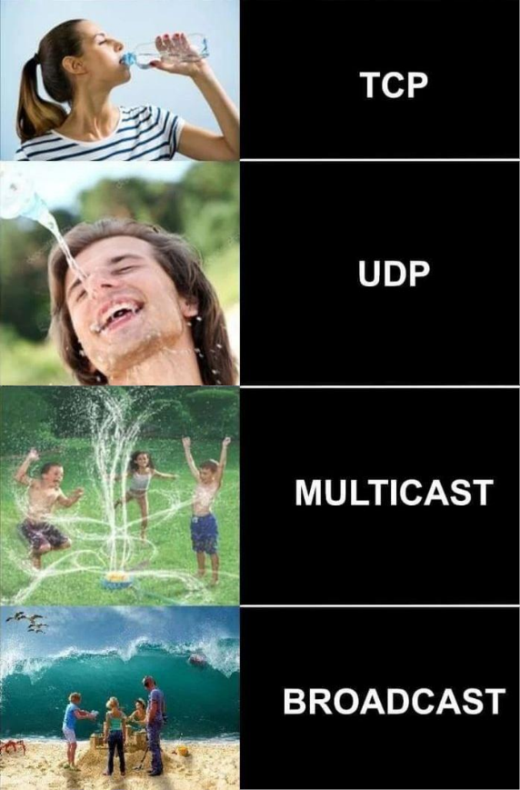  
*Görsel kaynağı: <https://www.pinterest.com/pin/808536939357862630/>*

  
*Görsel kaynağı: <https://www.softwaretestinghelp.com/tcp-vs-udp/>*

### 5-7: Uygulama Seviyesi Katmanları

Aslında uygulama seviyesi sadece 7. katmandır. Ancak 5 ve 6 yaygın
kullanılmadığından ve farklı uygulamalar arasında standart olmadığından
bu derste üçünü tek başlıkta inceliyoruz.

Uygulama programları genellikle 7. katmanda ulaşmakta ve genellikle
doğruden 4. katman ile iletişime geçmektedir. Oturum ve sunum gibi işlemler yapılacaksa da genellikle uygulama içerisinde yapılıp 4. katmana aktarılmaktadır.

#### Yaygın kullanılan bazı servisler

Bilgisayar ağları kapsamında **Servis** (hizmet) kavramı, ağ üzerinde belirli bir portu dinleyen uygulama anlamındadır. Örneğin, WEB portunu (TCP 80) web sunucusu dinler. Web sunucusu uygulamasına servis denir bu durumda.

- DHCP (UDP 67 & 68)
- DNS (UDP 53)
- HTTP (TCP 80)
- HTTPS (TCP 443)
- SMTP (TCP 25)
- SSH (TCP 22)
- RDP (TCP 3389)
- MS-SQL (TCP 1433)
- MySQL (TCP 3306)

## OSI modelini anlamak için kullanılabilecek uygulamalar

- **ping** (hping): Karşı uç ile aramızda 3. katmanda bağlantı var mı? Paketler kaç milisaniyede gidip geliyor? Büyük paketler ve küçük paketler ağdan aynı şekilde gidebiliyor mu?
- **traceroute (tracert)**: Uzzktaki bir sisteme IP üserinden hangi rotadan gittiğimizi gösterir. ICMP kapalı olan sistemlerde `TCP Trace` denenebilir.
- **Telnet**: Ağlarda yönetim ve kontrol amaçlı kullanılır. Ağ cihazlarının genellikle tamamı telnet ile yönetimi destekler. Bunun dışında, 2 cihaz arasında 4. katmanda bağlantı (erişebilirlik) kontrolü yapmak için de kullanılır. Örneğin SMTP veya HTTP gibi protokoller, Telnet ile çalıştırılabilir.
- **netstat** Bilgisayarımızda açık olan portları ve aktif ağ bağlantılarımızı gösterir. Linux'ta `sudo netstat -antulp` şeklinde en güzel çıktıyı verir.
- **nmap** (zenmap): TCP ve UDP port taraması yapar. 0-65536 arası tüm portlar ya da belirli portlar taranabilir. Script taraması sayesinde zafiyet taraması bile yapabilir. Çok güçlü bir araçtır.
- **wireshark (tcpdump)**: Ethernet kartını izler, tüm trafikleri kaydeder. İstenirse filtre girilerek kayıt yapması da sağlanabilir.
- **TCPView (Microsoft)** Windows'ta aktif ağ bağlantılarını gösterir. Hangi uygulama nereye bağlantı yapıyor?

## Wireshark ile trafik analizi

Örnek uygulamalar:

- DHCP trafiği
- TCP 3-way handshake
- HTTP/Telnet vb. parola görüntüleme
- DNS ve HTTP trafikleri arka arkaya

## OSI modeli ve güvenlik

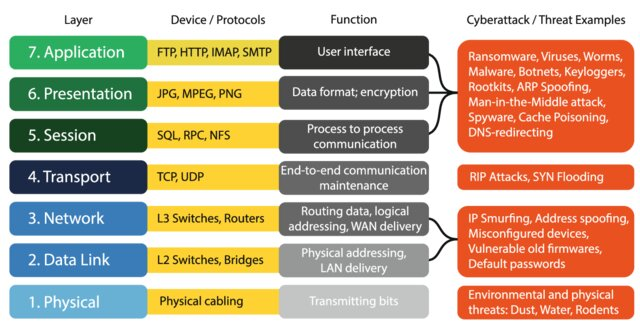  
*Görsel kaynağı: <https://www.researchgate.net/publication/346192126_Requirements_for_cybersecurity_in_agricultural_communication_networks/>*

### Bilgi güvenliğinin temel unsurları

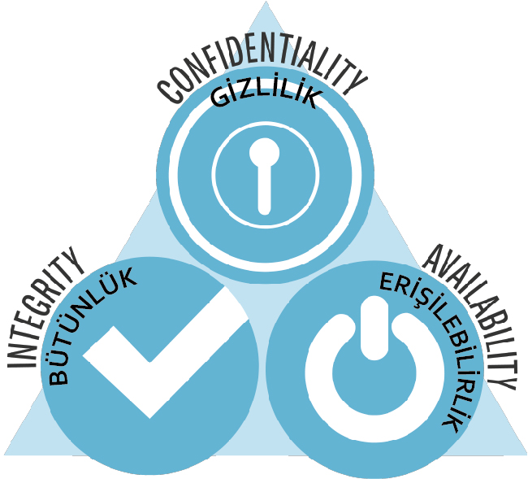{width="400"}  
*CIA üçgeni. Görsel kaynağı: <https://fikirjeneratoru.com/bilgi-guvenligi-ve-bilgi-guvenligi-unsurlari/>*

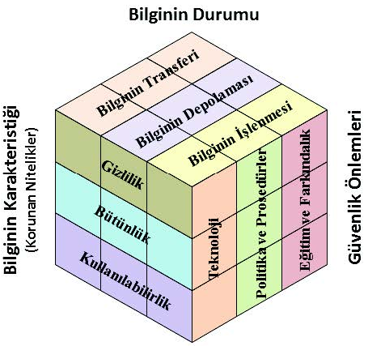  
*McCumber Küpü. Görsel kaynağı:  <https://fikirjeneratoru.com/bilgi-guvenligi-ve-bilgi-guvenligi-unsurlari/>*

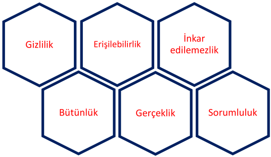  
*Genişletilmiş CIA üçgeni*
