# Yerel Ağlar - LAN/VLAN

## Ethernet Protokolü

İlk kez "INTEL VE XEROX" tarafından geliştirilmiştir.Daha sonra
IEEE(Institue of Electrical and Electronical Enginner) tarafından 802.3
ismi ile standartlaştırılmıştır.

**İsimlendirmeler**

- 10 Base 2: 10 sayısı 10 Mb/s’yi ifade eder. "Base" sözcüğü temel
bandı ifade eder. En sondaki kablo türüdür. 2 olduğunda ince (thin)
koaksiyel kablo ile ~200 metre sınırını belirtir.
- 10 Base 5: Sondaki 5 Kalın(thick) koaksiyel kablo olduğunu
belirtir.  
- 10 Base T: "T" harfi, bükümlü çift kablo olduğunu ifade eder.  
- 100 Base TX: Fast Ethernet Cat-5 kablo kullanılır.  
- 100 Base FX: F harfi Fiberoptik Kablo kullanıldığını belirtir.  
- 1000 Base T: Gigabit bükümlü çift kablo.
- 1000 Base LX: L long kısaltmasıdır. SM FO kablolar kullanılır. Uzak
mesafelerde tercih edilir. En önemli dezavantajı maliyetlerin SX’e göre
fazla olmasıdır.  
- 1000 Base SX: MM FO kablolar kullanılır.Kısa mesafeleri
destekler. Ekipmanları daha ucuzdur.  

## MAC Adresi

Yerel ağlarda haberleşmeyi sağlayan ethernet çerçevesinde(frame) 48
bitlik adres kullanılır. MAC adresi 16’lık sayı sisteminde 12 tane
karakter ile gösterilir.
  
*Görsel kaynağı: <https://tecadmin.net/media-access-control-address/>*

İlk 6 karakter (ilk 24 bit) üretici kodunu (OUI), son 6 karakter ise seri
numarasını belirtir. Bir üretici aynı MAC adresini birden fazla karta
veremez. Dolayısıyla -_teorik olarak_- MAC adresleri dünyada tektir (_uniq_). 

!!! warning "Dikkat"
    Birden fazla aynı MAC adresi aynı ağ üzerinde (LAN / VLAN) olmamalıdır.

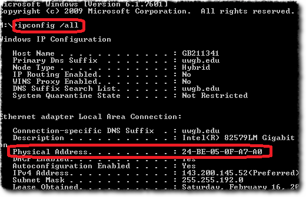  
*Görsel kaynağı: <https://uknowit.uwgb.edu/page.php?id=28810/>

## ARP

"Adres Çözümleme Protokolü" anlamındadır. İkinci katmanda çalışır. Ağdaki Bilgisayarların MAC adreslerini öğrenmek ve bu cihazdaki ARP tablosunu güncellemek en temel görevidir.

Ağa yeni bağlanan cihaz IP adresi henüz olmadığından yayın mesajı göndererek IP adresi ister. Anahtarlarda tutulan IP ve MAC adreslerinin tablosuna "ARP tablosu" denir. ARP Tablosu dinamik olarak güncellenir ancak istenirse elle düzenleme ya da statik kayıt işlemi yapılabilir.

Anahtarların MAC tablosu ve ARP tablosunu nasıl güncellediği aşağıdaki görselde görülmektedir.

  
*Görsel kaynağı: <https://community.fs.com/article/switch-mac-address-whats-it-and-how-does-it-work.html>*

!!! Question "Soru"
    ARP tablosunda "statik kayıt ekleme özelliği" ne işe yarar?

## Yayın Adresi (Broadcast Address)

Tüm yerel ağı temsil eden adrese **yayın adresi** denir. Bu adrese gönderilen veri, ağdaki tüm cihazlara aynı anda ulaştırılır. İkinci veya üçüncü katmanda yayın mesajı gönderilebilir.
  
İkinci katmanda yayın adresi göndermek için çerçevedeki hedef MAC adresi kısmında tüm bitler 1 yapılır. Dolayısıyla hedef adresi FF:FF:FF:FF:FF:FF olmuş olur.

Üçüncü katmanda yayın mesajı gönderebilmek için, hedef IP adresi kısmına o ağın son (en büyük) IP adresi yazılmalıdır. Üçüncü katmandaki yayın mesajları, sonraki bölümde detaylı incelenecektir.

## Yayın Alanı

Bir yayın paketi gönderildiğinde, bunu alabilen tüm cihazlar aynı yayın alanındadır. Yayın alanı içindeki bilgisayarlar ikinci katmanda MAC adresleriyle haberleşebilirler. **Bu bilgisayarlar aynı ağdadır**.

!!! note "Yayın alanı, ağ geçidinde biter"
    Bir bilgisayar kendi yayın alanında olmayan başka bir bilgisayarla  haberleşmek için "ağ geçidinden" geçmek zorundadır.

## Çarpışma (çakışma) Alanı

Aynı çarpışma alanındaki bilgisayarlar birbirine gelen her paketi görürler, ancak sadece kendi MAC adreslerine gelen her paketi işleme alırlar. Bir yayın alanı içerisinde bir veya birden fazla çarpışma alanı bulunabilir. Çarpışma alanı aynı anda sadece bir PC tarafından kullanılabilir. İki PC aynı anda veri göndermek isterse çarpışma(collision) oluşur. Adını buradan alır.

!!! note "Çarpışma alanı"
    Çarpışma alanı istenmeyen bir durumdur. HUB'lar çarpışma alanına sebep olur.

### Örnek 1

Aşağıdaki soruları görsele göre cevaplayın:

1. Kaç tane yayın alanı vardır?
2. Kaç tane çarpışma alanı vardır?
3. Her çarpışma alanında kaç tane bilgisayar vardır?
4. Her yayın alanında kaç tane bilgisayar vardır?

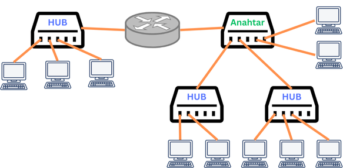{width=500}

### Örnek 2

Aşağıdaki soruları görsele göre cevaplayın:

1. A ile B aynı anda veri gönderebilir mi?
1. B ile C aynı anda veri gönderebilir mi?
1. C yayın mesajı gönderdiğinde tüm PC’lere gider mi?
1. B ile C aynı arasındaki trafiği E görür mü?
1. B ile C aynı arasındaki trafiği F görür mü?

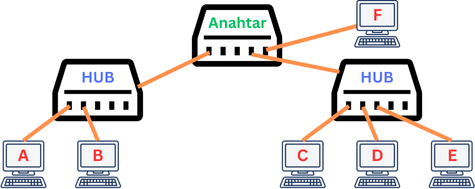

## Anahtarların Kapasitesi

Anahtar üzerinde pc’lerin haricinde dış dünya ile iletişim kurmak için
bağlantı yapılan porta "**uplink**" portu denir. Anahtarın bilgisayara
bağlanan normal portlarına "**access port**" denir. Bazı anahtarların tüm portları aynı kapasitede iken, bazı anahtarlarda ise uplink portları daha yüksek kapasiteli olur.

Anahtarın aynı anda çevirebileceği trafik miktarına "**backplane kapasitesi**" ya da "**anahtarlama kapasitesi** (switching capacity)" denir.

Bir anahtarın veri iletim performansını belirleyen en önemli faktörlerden biri de "**throughput**" olup, anahtarın belirli bir süre içinde iletebileceği maksimum veri miktarını ifade eder.

## Ağ Geçidi (gateway)

Bir ağdaki bilgisayarlar, kendi ağı dışındaki ağlara gidebilmek için ağ geçidinden geçmek zorundadır. Başka bir deyişle; "ağ geçidi, bir ağın dışarı açılan kapısıdır". Sıradan bir PC, 3.katman(L3) anahtar, yönlendirici veya özel üretilmiş donanımlar ağ geçidi görevi yapabilir. Hatta cep telefonumuzun internet bağlantısını bilgisayarımıza paylaştırdığımızda, cep telefonumuz, bilgisayar için bir "ağ geçidi" olmaktadır.

Bazı ağ geçitleri, üzerindeki ağ arayüzüne(interface) bağlı olarak ethernet, Frame Relay, ATM, PPPoE gibi protokolleri kullanılabilme özelliğine sahip olduğundan bazı kaynaklarda _protokol çevirici_ olarak adlandırılır.

Önceden bahsedildiği gibi, anahtarlar çarpışma alanını geçirmezler ancak yayın trafiğini geçirirler. İçerisinde çok faza bilgisayar bulunan yerel ağlarda yayın paketlerin çokluğu, ağı hantallaştırabilir. Bu nedenle LAN’ları birden fazla alt ağlara bölmek performansı arttıracaktır.

**Örnek yayın mesajları:**  

- IPV4 - IPV6 keşif mesajları
- Komşuluk mesajları
- Donanım keşif mesajları
- IP alma (DHCP)mesajları
- Virüs (solucan) gibi kötü yazılımlar

## Ağları bölmenin faydaları

1. **İşletme Kolaylığı**: Ağlar küçük olduğunda sorunu çözmek
    kolaylaşır. Ağ isimleri, IP grupları ve kullanım yerleri eşleştirilerek hiyerarşik sistemler oluşturulabilir.
2. **PC sayısını azaltmak**: Her bir ağdaki PC sayısını azaltarak yayın
    alanını daraltmak, fazlalık yayın mesajlarını azaltmak ve performansı arttırmak
3. **Güvenlik**: Birbirine erişimi kısıtlanması gereken ağlar arasında
    erişim denetim listeleri (Access Control List ~ ACL) oluşturularak
    erişim kısıtlanabilir.

## Alt Ağa Bölme Yöntemleri

**Klasik yöntem**de her bir ağ için bir fiziksel bir ağ geçidi kullanılması zorunludur. Dolayısıyla cihazların ve iletim ortamlarının sınırları en önemli kısıtlardır.

Bir **VLAN yapısı**nda ise fiziksel bir müdahale olmadan, hatta uzaktan bağlanarak ağ istenilen şekilde özelleştirilebilir.

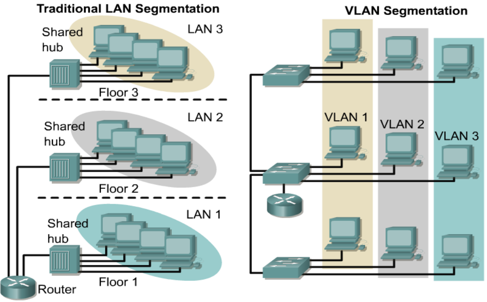
*Görsel kaynağı: <https://www.ictshore.com/free-ccna-course/vlans-configuration-cisco-switch/>*

**VLAN (Sanal ağ) kullanmanın avantajları**

- Farklı anahtarlar üzerindeki bilgisayarlar aynı ağda olabilir.
- Aynı anahtarda birden fazla farklı ağ (VLAN) olabilir.
- Ağlarda değişiklik yapmak için fiziksel değişiklik yapmaya gerek yoktur. Uzaktan dahi kolayca yapılabilir.

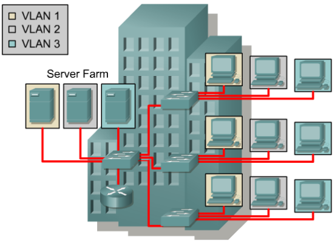

## VLAN Anahtarlar

Üzerinde sanal ağlar tanımlanabilen anahtarlardır. Aynı zamanda ayarlanabilir anahtarlardır. Bu nedenle yönetilebilir anahtarlar da denmektedir. VLAN anahtarın üzerindeki portlar gruplandırılarak birden çok sanal ağ oluşturulabilir.
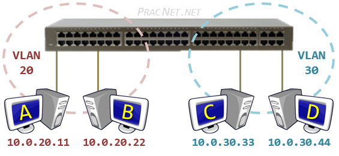  
*Görsel kaynağı: <https://www.practicalnetworking.net/stand-alone/routing-between-vlans/>*

Her bir sanal anahtar, ayrı bir ağ gibi çalıştırılabilir. Bu sanal ağlara "VLAN" (Virtual LAN ~ Sanal Ağ) denir. Her bir VLAN’ın kendine özel VLAN-ID  isminde bir tanımlayıcı numarası olur. Anahtarların fiziksel portları, VLAN ID’ler ile eşleştirilerek ağlar düzenlenir.

!!! info
    Aynı VLAN numarasına sahip portlar aynı sanal ağa aittir.

Bazı durumlarda VLAN yapılandırılması portlardan ve fiziksel bağlantılardan bağımsız olarak yapılabilir. Örneğin PC’nin MAC adreslerine göre, protokole göre (IP telefon gibi), kullanıcı kimlik doğrulama yöntemine göre (parola, parmak izi, vb.) VLAN ataması yapılabilir. VLAN anahtarlar üzerinde birden fazla sanal ağ oluşturulursa bu alt ağlar arasında trafiğin yönlendirilmesi gerekmektedir. Bu yönlendirme işlemi anahtarın kendi üzerinde veya ayrı bir yönlendirici cihazla yapmak mümkündür.

  
*Görsel kaynağı: <https://www.youtube.com/watch?v=SPloaasxkMQ>*

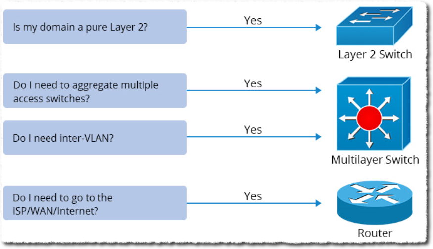  
*Görsel kaynağı: <https://www.qsfptek.com/qt-news/how-to-choose-best-aggregation-switch.html>*

Anahtar üzerinde yönlendirme yapılacaksa 3 katmanda(L3) çakıştırılacak
bir anahtar kullanılmalıdır.
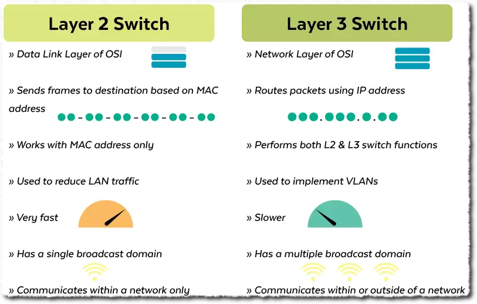  
*Görsel kaynağı: <https://planetechusa.com/layer-2-vs-layer-3-switches>

## IEEE 8021.Q VLAN protokolü

**Dot1q** olarak ta bilinir. Ethernet protokolü ilk tasarlandığında VLAN ihtiyacı yoktu. 1998 yılında yayınlanan 802.1q protokolü ile Ethernet protokolü VLAN farkındalığı kazandı.
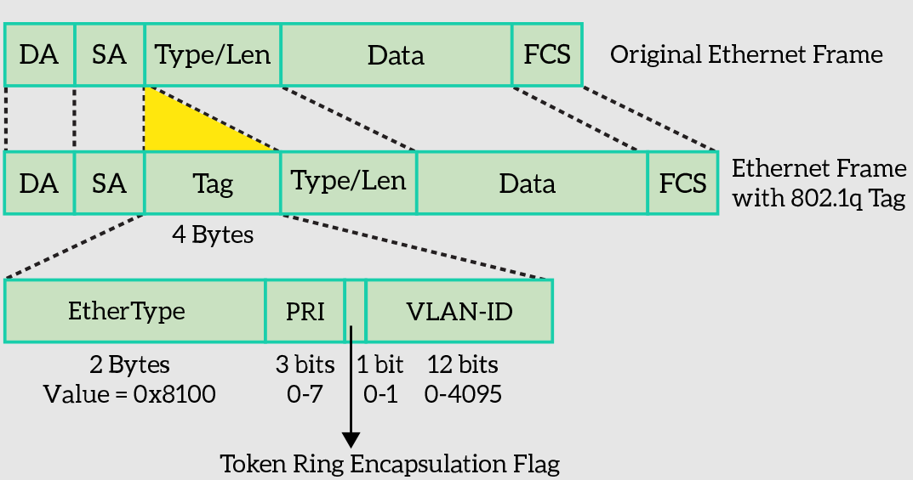  
*Görsel kaynağı: <https://www.ictshore.com/free-ccna-course/vlans-configuration-cisco-switch/>*

**trunk (tagged) port:** Anahtarın herhangi bir portundan birden fazla VLAN taşınması gerekiyorsa o port trunk olarak yapılandırılmalıdır. Aynı zamanda bu bağlantıya da "trunk" denir. Genellikle iki anahtar arasında kullanılır ancak ihtiyaca göre 1 bilgisayara bile trunk bağlantı verilebilir. Anahtarlar, bu portta gelen-giden trafiklere bakarak başlık bilgisindeki trafiğin ilgili VLAN'a gitmesini sağlar.

**acces (untagged) port:** Bu portta VLAN etiketleri olmaz. Anahtar üzerinde config yapılarak, bu porttan gelen-giden tüm trafiğin belirli bir VLAN'a gitmesi sağlanır.
  
*Görsel kaynağı: <https://networklessons.com/switching/802-1q-encapsulation-explained>*

Cisco firması `trunk/access` sözcüklerini kullanırken diğer üreticiler genellikle `tagged/untagged` sözcüklerini tercih etmektedir.

## Anahtar Kullanım Mimarisi

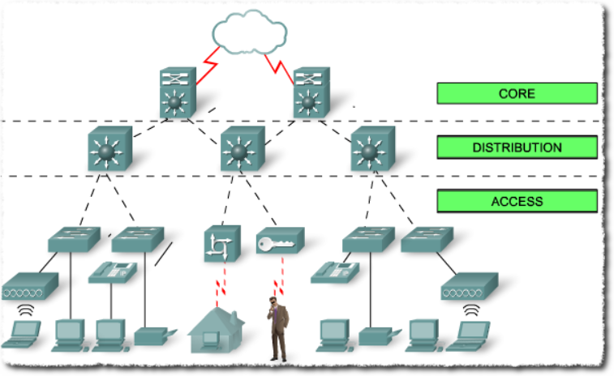  
*Görsel kaynağı: <https://blog.router-switch.com/2014/04/network-design-with-examples-core-and-distribution/>*

1. **OMURGA(CORE)**  
Üçüncü katman veya daha üstü anahtar kullanılır.Genellikle tüm VLANlar
burada oluşturulur.Ağın tüm yönlendirme yükü bunun üzerindedir.Bu nedenle
genellikle yedekli kullanır.Performansı çok fazladır.Binalar arası
bağlantıyı sağlamak için kullanılır.Bu nedenle çok sayıda fiberoptik
port sergilerler.Modüler yapıdadırlar,yani port sayıları ve türleri
modüler halinde takılıp çıkartılabilir. Modüllerin takıldığı yere "şase"
denir.Fiziksel olarak çok yer kaplarlar ve pahalıdırlar.  
  
*Görsel kaynağı: <https://thenetworkinstallers.com/blog/fiber-optic-installation-process/>*

2. **Dağıtım(Distrubution)Katmanı**  
Omurga anahtarında bağlı olan ve binaların içerisinde küçük bir omurga
gibi düşünebileceğimiz anahtarlardır. Omurga anahtarına göre daha
ucuzdur.L2 veya L3 olabilir.  

3. **KENAR**  
Son kullanıcı cihazlarının bağlandığı anahtarlardır. Bu nedenle
özel görevleri olabilir.  
İhtiyaca göre:

- 802.1x(Kimlik Doğrulama)  
- PoE(802.3aaf) Enerji göndermek için kullanılır.  
- Güvenlik (port-security, DHCP koruması, vb.)

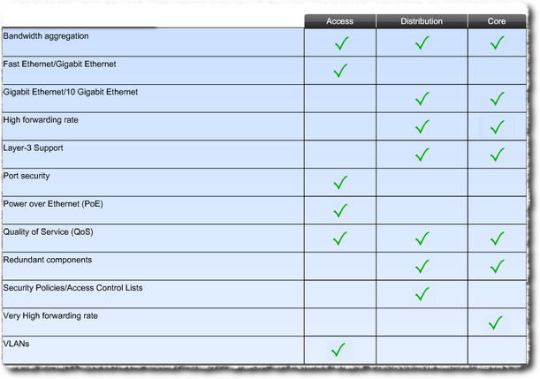  
*Görsel kaynağı: <https://blog.router-switch.com/2014/04/network-design-with-examples-core-and-distribution/>*

**Örnek:**  
20 portlu bir VLAN anahtar 4 portlu bir ağ geçidine
bağlanıyor. Aşağıdaki durumları yorumlayınız.

1. Her VLAN'daki port sayısı 5’er tanedir.
1. Bu VLAN anahtar üzerine doğrudan bağlanacak PC sayısı 16’dır.
1. Her VLAN'a atanmış portlar ardışık olmak zorundadır.
