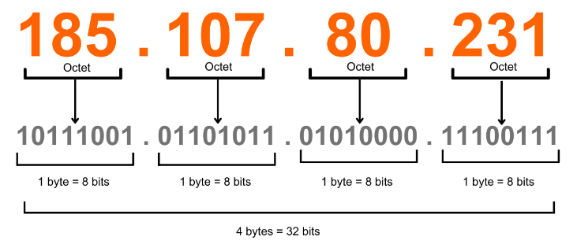
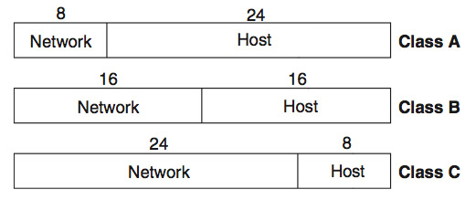
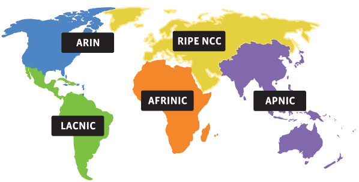
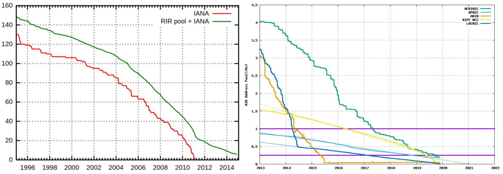
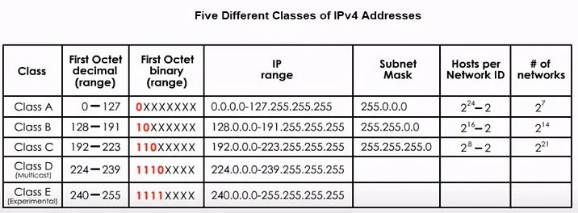
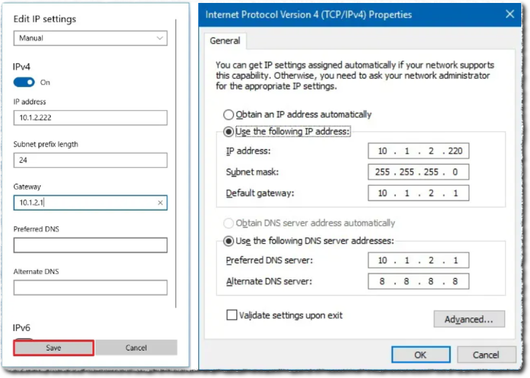
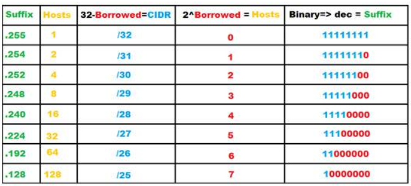

*[RIR]: Regional Internet Registry


# IPv4 ve IPv6
IPv4 adresleri tükendiği için, artık IPv6 adresleri dağıtılmaktadır. Uzunca bir süre daha ikisini birlikte kullanmak zorundayız.

IPv4 adresleme sisteminde $2^{32}$ IP adresi kullanılabilirken, IPv6 adreslemesinde $2^{128}$ adet IP adresi kullanılabilmektedir. Aşağıda bu iki sayı açık olarak yazılmıştır:

- **IPv4 adres sayısı**: $4.294.967.296$ (yaklaşık 4,3 milyar)
- **IPv6 adres sayısı**: $340.282.366.920.938.463.463.374.607.431.768.211.456$

**Bu ders içerisinde IP ifadesi her kullanıldığında, IPv4 anlaşılmalıdır.** Bu ders açısından ikisi arasındaki en önemli fark; birisinin 32, diğerinin ise 128 bit olmasıdır. IP hesaplamaları tamamen aynıdır. Hesap mantığını anlamak için v4 hesapları -*kısa olduğu için*- daha iyi olacaktır. Sonrasında aynı hesapları v6'da da yapabilirsiniz.

# IP Adresi ve Hesaplamaları
32 bit uzunluğa sahip olan IP adresi 2 temel bileşene sahiptir:
1.  Ağ tanımlayıcı
2.  Host tanımlayıcı

  
*IP bileşenleri*

**host:** Bir ağ içerisinde IP atanabilen ve kendisinin ağa bağlanma
ihtiyacı olan bilgisayar, yönlendirici, güvenlik duvarı, akıllı saat, cep telefonu, vb. cihazların tümüne **host** denir.

IP adresinin bu iki bileşeni hesaplanırken alt ağ maskesine ihtiyaç
duyulur. Temel olarak alt ağ maskesi IP adresinin sınıfına göre
belirlenir. IP adresleri 32 bitin sekizerli olarak gruplandırılması ve
decimal olarak gösterilmesi şeklinde olur. Bu 8 bitlik grupların her
birine oktet denir. Her oktet birbirinden nokta ile ayrılır.

  
*Görsel kaynağı: https://www.cloudns.net/blog/what-is-ipv4-everything-you-need-to-know/*

Bir IP adresinin bağlı olduğu **sınıf** ilk oktetinden anlaşılır.
  
*IP sınıfları*

**ÖRNEK :** 16 tane IP adresini bölüyoruz. (${2^4}$ bit )\
\
XXX -------------------------------------- IMAGE
----------------------------------- XXX\
\
**NOT :** Ağlardaki bilgisayar sayıları(kullanılabilecek ip sayıları)
belirlenirken maksimum kapasite 2'nin kuvveti ${2^n}$ alınarak
belirlenir.

**ÖRNEK :** Bir şirketin iki farklı şubesinde 120 ve 280 adet bilgisayar
kullanılmaktadır. Bu şirketler için optimal ağ büyüklüklerini
hesaplayınız.

-   $120 => 2^n = 2^7 => 128$

-   $280 => 2^n = 2^9 => 512$

**NOT :** Host tanımlayıcısı kısmında belirtilen bitlerde elde
edilebilecek en büyük sayı o ağda kullanılabilecek IP adresi sayısıdır.
Her ağın ilk IP adresi [\"ağ adresi\"]{.underline} ve son IP adresi
[\"yayın adresi\"]{.underline} olarak kullanıldığından her ağda
kullanılabilecek host sayısı IP sayısından 2 eksiktir.

-   Host bitleri : n tane

-   Ağdaki IP adresi : $2^n$ tane

-   Ağda kullanılabilecek host sayısı $2^n-2$

**ÖRNEK :** 10.9.8.0 IP adresinin 30. bitten sonrasının bulunduğunu
varsayalım. Alt ağ IP adresinin kullanım amacına göre yazalım.

  -------- --------
  \.....   \.....
  30 bit   2bit
  -------- --------

IP sayısı $2^2=4$ tane Host sayısı $2^2-2=2$ tane

  ------------------------------------------ ----- -----------------------------
  1.IP adresi 10.9.8.0                       -\>   Ağ adresi
  2\. ve 3. IP adresi 10.9.8.1 ve 10.9.8.2   -\>   Hostlar için kullanılabilir
  4\. IP adresi 10.9.8.3                     -\>   Yayın adresi
  ------------------------------------------ ----- -----------------------------

**NOT :**

  Ağ sayısı   Host sayısı   Toplam host sayısı
  ----------- ------------- --------------------
  1           16            14
  2           8             $2(8-2) =12$
  4           4             $4(4-2) = 8$

## IANA: IP Dağıtan Kuruluş
https://www.iana.org/ web sitesinde faaliyetleri hakkında bilgi alınabilir.

  
*IANA tarafından yetkilendirilen bölgesel internet kayıtçıları (RIR)*

IANA, IP adreslerini /8 şeklinde RIR'lara dağıttı.
  
*Görsel kaynağı: https://www.iana.org/assignments/ipv4-address-space/ipv4-address-space.xhtml*

IANA elindeki tüm IPv4 adresleri 2011'de bitti.
  
*Görsel kaynağı: https://en.wikipedia.org/wiki/IPv4_address_exhaustion*

## IP Sınıfları

IP'nin ilk tasarlandığı sıralarda ortaya çıkmış bir kavramdır.
Kurumlarda IP adresleri tahsis edilirken ihtiyaca göre optimal sayıda
verebilmek için tasarlanmıştır. En büyük IP sınıfı A sınıfı, en küçük IP
sınıfı C sınıfıdır.

  
*Görsel kaynağı: https://medium.com/networks-security/tricks-to-remember-five-classes-of-ipv4-484c191678fb*

- **A sınıfı:** İlk biti 0'dır. İlk oktet **0-127** arasında olur. Varsayılan ağ maskesi **255.0.0.0**'dır. A sınıfı bir IP adresinde $2^{24}$ tane IP oluşturulabilir.
- **B sınıfı:** İlk iki biti 10 şeklindedir. Ondalık formda ilk
okteti **128-191** şeklindedir. Varsayılan alt ağ maskesi
**255.255.0.0**'dır. B sınıfı bir IP adresinde $2^{16}$ tane IP
oluşturulabilir.
- **C sınıfı:** İlk üç biti 110 şeklindedir. Ondalık formda ilk
okteti **192-223** arasındaki adreslerdir. Varsayılan alt ağ maskesi
**255.255.255.0**'dır. B sınıfı bir IP adresinde $2^{8}$ tane IP
oluşturulabilir.
- **D sınıfı:** İlk dört biti 1110'dır. Ondalık formda ilk
okteti **224-239** arasındadır. **Multicast** (Çoklu yayın) olarak
bilinir. Normalde hostlarda kullanılmaz.
- **E sınıfı:** İlk okteti, **240-248** ile başlar. Deneysel amaçlar için rezerve
edilmiştir. Normalde hostlarda ve ağlarda kullanılmaz.

  
*Görsel kaynağı: https://www.routerfreak.com/definitive-guide-ip-address-classes/*


### Peki neden böyle bir sınıflandırma yapıldı?
```
  Ağ biti   Host bitleri    Her ağdaki IP sayısı
  --------- --------------- ----------------------
  8         24-\>A sınıfı   $2^{24}$ tane IP
  16        16-\>B sınıfı   $2^{16}$ tane IP
  24        8-\>C sınıfı    $2^8$ tane IP
```
**ÖRNEK :** 132.x.x.x IP adresi B sınıfıdır. 132.45.x.x IP adresinin ilk
iki okteti ağ tanımlayıcısı son iki oktet host tanımlayıcısıdır. $2^16$
tane IP alabilir.

112.x.x.x IP adresi A sınıfıdır. $2^{24}$ tane IP alabilir.

193.140.253.x IP adresi C sınıfıdır. $2^8$ tane IP alabilir.

## Özel IP Adresleri(Private IP Blocks)

İnternette kullanılmayan IP adresleridir. İnternet üzerinde hiçbir
yönlendirici tarafından yönlendirilmeyen IP adresleridir. Bu adreslerin
kullanım amacı test uygulamaları ve NAT uygulamaları gibi durumlardır.
IP adresleri tükendiğinden kurumlarda kullanılan bilgisayarların
tamamına yetmemektedir. Bu nedenle günümüzde kurumların iç ağlarında
özel IP adresleri istenilen sayıda kullanılabilir.

-   10.0.0.0/8 -\>$2^{24}$ IP adresi

-   172.16.0.0 -\>$2^{20}$ IP adresi

-   192.168.0.0 -\>$2^{16}$ IP adresi

**NAT(Network Address Translation)**

XXX -------------------------------------- IMAGE
----------------------------------- XXX\

## Ağ Maskesi (Netmask)

Ağ maskesinin iki temel görevi vardır:
1. Ağın büyüklüğünü belirtmek
2. Ağın nerede başladığını hesabında kullanmak

  
*Görsel kaynağı: https://www.bestpickreports.com/blog/post/6-painting-hacks-with-tape/*

IP adreslerinin bitlerden oluştuğunu ve iki bileşeni olduğunu biliyoruz. Bu iki bileşenin hangi bitten ayrılacağını bulmak için ağ maskesi kullanılır. IP adresi ile beraber, ağ maskesinin kullanılması zorunludur.


  
*Windows'ta iki farklı yerden IP yapılandırması yapılabiliyor. Görsel kaynağı: https://pureinfotech.com/set-static-ip-address-windows-10/*

  
*Görsel kaynağı: https://www.trance-cat.com/electrical-circuit-calculators/en/subnet-mask-calculator.php*

## Ağ adresi
Ağ maskesi herhangi bir IP adresi ile ikilik sistemde çarpılırsa(ve işlemi) çıkan sonuç ağın adresini verir. Bu sayede, ağın nerede başladığı bulunmuş olur.

**ÖRNEK :**

-   IP : 192.168.1.75

-   Ağ maskesi : 255.255.255.0

-   11000000.10101000.00000001.01001011

-   11111111.11111111.11111111.00000000

-   11000000.10101000.00000001.00000000

-   Ağ adresi 192.168.1.0

## Ağ adresi ve yayın adresinin pratik hesabı
IP adresinin bölündüğü biti biliyorsak; **IP adresinde** bu bitten sonrası `1` yapılırsa, `yayın adresi`ni buluruz. Aynı bitleri `0` yaptığımızda ise `ağ adresi`ni buluruz.

## CIDR Notasyonu

Elimizde sadece IP adresleri olduğunda ağla ilgili yeterli bilgiye
ulaşamadığımızı, ilave olarak IP adresinin hangi bitten bölündüğünü
bilmemiz gerektiğini biliyoruz. Bunun için ağ maskesine alternatif
olarak CIDR Notasyonu kullanılmaktadır. Bu gösterim şeklinde IP
adresinin sağına \"/\" işareti konulup bölünen bit numarası yazılır.

**ÖRNEK :**

-   192.168.1.75 IP adresli ve 255.255.255.0 ağ maskesine sahip bir
    cihazın CIDR notasyonu 192.168.1.75/24 şeklindedir.

-   10.1.0.0 ve 255.0.0.0 ise 10.1.0.0/8 olarak gösterilir.

-   10.9.8.0 ve 255.255.255.128 ise 10.9.8.0/25 şeklinde gösterilir.
    (128 ikilik tabanda 10000000 şeklinde gösterildiğinden soldan 25
    tane 0 vardır.)

## IP hesaplarında formüller ve özet
1. IP (v4) adresleri $32$ bitten oluşur. Bu $32$ bitin soldan itibaren $M$ tanesi ağı tanımlar. geri kalan $N$ tanesi de ($ N=32-M $) hostları tanımlar. Bu iki bileşeni birbirinden ayırmanın iki yolu vardır:
   * **CIDR** gösteriminde bölü işareti ( "/" ) kullanılır. örnek: $10.5.0.100/16$
   * **Maske** ile gösteriminde M tane 1, N tane 0 olacak şekilde bitler ifade edilir. Sonra 10'luk sisteme çevrilerek Ip adresinin yanına yazılır. Örnek: $10.5.0.100 - 255.255.0.0$
1. Bir **ağda kaç IP** olduğunu bulmak için, bölü işaretinden sonraki bitlerin sayısına bakılır. $N$ tane bit varsa, $ 2^N $ formülü ile ağdaki IP sayısı hesaplanır.
1. Ağları alt ağlara bölmeye başlamadan önce mutlaka mevcut ağı tanımla. Nerede başlar? Nerede biter? Maskesi nedir? CIDR gösterimi nedir? Bu ağda kaç IP vardır?
1. Bir ağın **alt ağ maskesi**ni bulmak için;
   * IP adresinde, bölü'den önceki bitlerin tamamı 1 yapılır.
   * IP adresinde, bölü'den sonraki bitlerin tamamı 0 yapılır.
   * Sonra 10'luk sisteme çevrilir.
1. Bir ağın **ağ adresi**ni bulmak için;
   * IP adresinde bölü'den sonraki bitlerin tamamı 0 yapılır. Sonra 10'luk sisteme çevrilir.
1. Bir ağın **yayın adresi**ni bulmak için;
   * IP adresinde bölü'den sonraki bitlerin tamamı 1 yapılır. Sonra 10'luk sisteme çevrilir.
1. **/N** şeklinde verilen bir ağı 2 alt ağa bölersek, yeni ağlar **/(N-1)** olmuş olur. Yani bölü işareti 1 bit sağa kaymış olur. Örneğin, /20 şeklinde bir ağı ikiye bölersek iki tane /21 ağ oluşur. Benzer şekilde, **/N** şeklindeki bir ağı dörde bölersek, 2 bit kaydırmalıyız. Yani /20 şeklindeki ağ dörde bölünürse elimizde 4 tane /22 ağ oluşur.


## Alt Ağa Bölme

IP adresi ve ağı temsil eden bit sayısı belirli olan bir ağ birden fazla
küçük ağlara bölünebilir. Alt ağa bölme işlemi alt ağ maskesinde bir bit
kaydırılarak yapılır. Bu şekilde $2^n$ tane alt ağ bölme işlemi
yapılabilir.

**ÖRNEK :**

**a)** 10.0.0.0/24 ağını iki ayrı ağa bölünüz.

**b)**Yeni oluşturulan ağlar için 10.0.0.100 ve 10.0.0.150 IP
adreslerinin aynı ağda olup olmadıklarını hesaplayın. (İpucu : Ağ adresi
= IP x Ağ maskesi)

**c)**128 IP'li ağların her birini ikiye bölünüz.

[Çözüm :]{.underline}

**a)**

-   Ağ : 10.0.0.0/24

-   Ağ maskesi : 255.255.255.0 (24 tane 1, 8 tane 0 var. $2^8$ tane IP
    var)

-   Ağ maskesi : 11111111.11111111.11111111.00000000 ağ maskesinde 1 bit
    sağa kaydırdığımızda 25 tane 1, 7 tane 0 olacaktır. $2^7=128$ tane
    IP elde edilir.

1 bit kayarsa $2^1=2$ alt ağ, 2 bit kayarsa $2^2=4$ alt ağ, \.... ,n bit
kayarsa $2^n$ alt ağ elde edilebilir.

10.0.0.0/25 notasyonuna sahip bir ağda 1.alt ağ 10.0.0.0 IP adresiyle
başlar. 128 adet IP tanımlanır. Son IP 10.0.0.127 olur. 2. alt ağ ise
10.0.0.128 IP adresinden 10.0.0.255 IP adresine kadar 128 adet IP
alabilir.

         Ağ adresi       Yayın adresi   Ağ maskesi        IP sayısı   Host sayısı
  ------ --------------- -------------- ----------------- ----------- -------------
  1.ağ   10.0.0.0/25     10.0.0.127     255.255.255.128   128         126
  2.ağ   10.0.0.128/25   10.0.0.255     255.255.255.128   128         126

**b)**

  ------------- ------------------------------------- --- ------------
                00001001.00000000.00000000.01100100   =   10.0.0.100
  ağ maskesi:   11111111.11111111.11111111.00000000   =   10.0.0.128
                00001001.00000000.00000000.10010110   =   10.0.0.150
  ------------- ------------------------------------- --- ------------

Son oktetleri farklı olacağından aynı ağda değillerdir.

**c)**

      1.ağ           2.ağ
  ------------- ---------------
   10.0.0.0/25   10.0.0.128/25

Ağ maskesi 255.255.255.128

1111111.11111111.11111111.10000000

Yeni oluşan ağ maskesi 255.255.255.192\
\
XXX --------------------- TABLO ------------------------ XXX\
\
\
\
XXX --------------------- TABLO ------------------------ XXX\
\
\
\
XXX --------------------- TABLO ------------------------ XXX\
\
\
\
XXX --------------------- TABLO ------------------------ XXX\
\
**SORU :** 10.9.6.0/25 ağını 4 ayrı ağa bölünüz.

Ağ maskesi 255.255.255.0 11111111.11111111.11111111.0

  ----------------- --- --------------------------------------------------------
  Yeni ağ maskesi   :   11111111.11111111.11111111.11100000 ($2^5=32$ IP var.)
                    :   255.255.255.224
  ----------------- --- --------------------------------------------------------

\
XXX --------------------- TABLO ------------------------ XXX\
\
**ÖRNEK :** 10.0.0.0/22'yi 4 alt ağa bölünüz.

11111111.11111111.11111100.00000000 $2^{10}=1024$ tane IP var.

Ağ maskesi : 255.255.252.0

Yeni alt ağ maskesi : 255.255.255.0(2 bit kaydı.$2^{8}=256$ IP var.) d
Yeni CIDR gösterimi -\> 10.0.0.0/24 olmalıdır.

10.0.0.0 -\> 10.0.0.255

10.0.1.0 -\> 10.0.1.255

10.0.2.0 -\> 10.0.2.255

10.0.3.0 -\> 10.0.3.255

**ÖRNEK :** /17 şeklinde gösterilen ağın maskesi nedir?

11111111.11111111.10000000.00000000 = 255.255.128.0 şeklindedir.

**ÖRNEK :** 10.10.0.0 ve 255.255.0.0 şeklindeki ağda kaç host olabilir?

$2^{16}-2$ adet host olabilir.

**NOT :** Özel IP ile ??? 127 ile başlayan IP ler kullanılamazlar.
Localhost : 127.0.0.1 bilgisayarın kendisini temsil eder.

169.254.0.0 Windows işletim sisteminin IP alınamadığında kendi IP
bloğundan otomatik olarak verdiği IP adresidir.

**ÖRNEK :** Bir şirkete 192.168.100.0/24 şeklinde IP aralığı tahsis
edilmiştir. Şekilde sistem yöneticisi ağdaki aşırı yayın trafiğinin
sorun çıkardığını düşünerek ağı alt ağlara bölmek istiyor. Birimlerin PC
sayısı aşağıdaki gibidir. Teknik birim=70, Pazarlama=40, Muhasebe=20,
İdari birim=25\
\
XXX -------------------------------------- IMAGE
----------------------------------- XXX\
\
\

## Ağ Geçidi IP Adresleri 

Her ağ için ilk IP adresi ağ adresi, son IP adresi yayın adresi olduğunu
biliyoruz. Kural olmamakla birlikte genel teamüllere göre ağ adresinden
sonraki ilk IP adresi(kullanılabilecek ilk host adresi) ağ geçidi olarak
belirlenir. Herhangi bir host adresi ağ geçidi olarak belirlensede
hiçbir problem olmaz.

**NOT :** IP adresinin ve ağın son IP adresi değiştirilemez.

**NOT :** Ağ geçidi IP adresi herbir ağın doğrudan bağlı olduğu
yönlendirici arayüzünde(interface, ara birim, ethernet kartı,
NIC(Network Interface Card)) tanımlı olan IP adresi olmak zorundadır.

Günümüzde kullanılışı :\
\
\
XXX -------------------------------------- IMAGE
----------------------------------- XXX\
\
\
[Soruya gelirsek : ]{.underline}\
\
XXX --------------------- TABLO ------------------------ XXX\
\
Ağ adresi : 192.168.0.0

Yayın adresi : 192.168.100.127\
\
XXX --------------------- TABLO ------------------------ XXX\
\
\
\
XXX --------------------- TABLO ------------------------ XXX\
\
\
\
XXX --------------------- TABLO ------------------------ XXX\
\
\
\
XXX --------------------- TABLO ------------------------ XXX\
\
Alt ağ maskesi ise teknik:255.255.255.0,

pazarlama:255.255.255.192,

muhasebe:255.255.255.224,

idari:255.255.255.255 ??? şeklindedir.

**ÖRNEK :** 10.50.100.200/25 şeklinde IP adresi tahsis edilmiş bir
bilgisayarın ağ adresi ve yayın adresi nedir?

32-25=7 olduğundan $2^7 =128$ tane IP var.

  --- ----------------- --------------
      10.50.100.200     
  x   255.255.255.128   
      10.50.100.128     ağ adresi
      10.50.100.255     yayın adresi
  --- ----------------- --------------

**ÖRNEK :** Aşağıdaki bilgisayarlardan hangileri ağ geçidine ihtiyaç
duymadan haberleşirler.

::: center
  ----- --------------- ------------------------- ------
                          [Ağ adresi]{.underline} 
    a\) 10.0.0.120/25                    10.0.0.0 -128
    b\) 10.0.0.121/24                    10.0.0.0 -256
    c\) 10.0.0.254/24                    10.0.0.0 -256
    d\) 10.0.0.1/24                      10.0.0.0 -256
    e\) 10.0.0.253/25                    10.0.0.0 -128
  ----- --------------- ------------------------- ------
:::

**NOT :** X'in Y ile aynı ağda olup olmadığını anlamak için X
bilgisayarı Y nin IP adresiyle kendi ağ maskesini çarpar. Kendi ağ
adresiyle karşılaştırır.

A'nın B ile haberleşmesi :

  ------------------ --- ------------ -- --
  B'nin IP adresi        10.0.0.121      
  A'nın ağ maskesi   x   10.0.0.128      
                         10.0.0.0        
  ------------------ --- ------------ -- --

Çıkan sonuç A'nın ağ adresiyle aynı olduğundan haberleşirler.

A'nın C ile haberleşmesi :

  ------------------ --- ------------ -- --
  C'nin IP adresi        10.0.0.254      
  A'nın ağ maskesi   x   10.0.0.128      
                         10.0.0.128      
  ------------------ --- ------------ -- --

Çıkan sonuç A'nın ağ adresiyle aynı olmadığından haberleşemezler.
